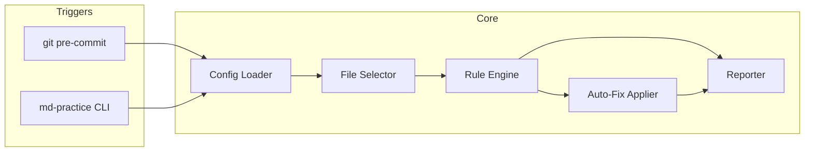

# Design Document: Markdown Practice Hook

## Overview

A small Node.js (or shell-invoked Node) tool that loads project Config, selects Markdown files, runs a rule engine, optionally applies Auto_Fixes, prints a Report, and exits with git-friendly codes. Distributed as a repo-local package script plus an installable git pre-commit Hook.

No editor/IDE coupling. Same engine powers CLI and Hook.

## Architecture



### Flow

1. Load Config (`.md-practice.yml` / `.md-practice.json`) or defaults.
2. Resolve file set: staged Markdown (Hook default) or path/globs (CLI).
3. For each file: run enabled Rules → collect Violations → apply fixable ones if `fix`.
4. Re-stage modified staged files (Hook + `fix` only).
5. Print Report; exit non-zero if any `error` remains.

## Config Schema (illustrative)

```yaml

# .md-practice.yml
mode: fix                    # check | fix (Hook default; CLI can override)
files: staged                # staged | all  (Hook); CLI ignores in favor of args
include:
  - "**/*.md"
  - "**/*.markdown"
exclude:
  - "**/node_modules/**"
  - "**/CHANGELOG.md"
failFast: false
rules:
  trailing-whitespace:
    severity: error
    fix: true
  consecutive-blank-lines:
    severity: error
    fix: true
    options:
      max: 1
  blanks-around-headings:
    severity: error
    fix: true
  blanks-around-fences:
    severity: error
    fix: true
  heading-increment:
    severity: error
    fix: false
  single-h1:
    severity: warning
    fix: false
    options:
      required: true
  line-length:
    severity: warning
    fix: false
    options:
      max: 120
      ignoreUrls: true
  list-marker-style:
    severity: error
    fix: true
    options:
      style: "-"             # "-" | "*"

```

JSON Config is equivalent. Ship `config.schema.json` for editor validation of the Config file itself (optional nice-to-have).

## Components and Interfaces

| Component | Responsibility |
| ----------- | ---------------- |
| `bin/md-practice` | CLI: `--check`, `--fix`, `[paths...]`, `--config <path>` |
| `src/config.ts` | Load/validate Config; merge defaults |
| `src/select-files.ts` | Glob include/exclude; staged-only via `git diff --cached --name-only` |
| `src/engine.ts` | Run Rules; orchestrate fix pass |
| `src/rules/*.ts` | One module per Rule id |
| `src/report.ts` | Terminal Report |
| `scripts/install-hook.ts` | Write `.git/hooks/pre-commit` (idempotent) |
| `hooks/pre-commit.sh` | Thin wrapper calling `md-practice` with Config mode |

### Core Interfaces

```typescript

interface RuleContext {
  filePath: string;
  lines: string[];
  options: Record<string, unknown>;
}

interface Violation {
  ruleId: string;
  severity: 'error' | 'warning';
  line: number | null;
  message: string;
  fixable: boolean;
}

interface Rule {
  id: string;
  description: string;
  defaultSeverity: 'error' | 'warning';
  check(ctx: RuleContext): Violation[];
  fix?(ctx: RuleContext, violations: Violation[]): string[] | null; // new lines or null
}

interface EngineResult {
  violations: Violation[];
  fixedFiles: string[];
  filesChecked: number;
}

interface ReportData {
  errors: number;
  warnings: number;
  fixedFiles: string[];
  violations: Violation[];
}

```

### Git Hook Install

- Target: `.git/hooks/pre-commit`
- Marker comments around managed block so re-install replaces only that block
- Invoke: `npx md-practice` or `node path/to/cli` with no path args (uses `files: staged`)
- Missing git repo → install fails with clear message

## Data Models

### Config Model

```typescript

interface MdPracticeConfig {
  mode: 'check' | 'fix';
  files: 'staged' | 'all';
  include: string[];
  exclude: string[];
  failFast: boolean;
  rules: Record<string, RuleConfig>;
}

interface RuleConfig {
  severity: 'error' | 'warning' | 'off';
  fix: boolean;
  options?: Record<string, unknown>;
}

```

Config is loaded from `.md-practice.yml` or `.md-practice.json` at repo root. See Config Schema section above for full illustrative example.

### Exit Codes

| Code | Meaning |
| ------ | --------- |
| 0 | Success; no remaining `error` Violations |
| 1 | One or more `error` Violations remain |
| 2 | Config invalid or tool/runtime failure |

## Correctness Properties

*A property is a characteristic or behavior that should hold true across all valid executions of a system — essentially, a formal statement about what the system should do. Properties serve as the bridge between human-readable specifications and machine-verifiable correctness guarantees.*

### Property 1: File selection respects include/exclude patterns

*For any* set of file paths and any valid include/exclude glob configuration, the file selector SHALL return exactly the files matching at least one include pattern and matching no exclude pattern.

**Validates: Requirements 1.2, 7.3, 8.1**

### Property 2: Config merge preserves user settings

*For any* valid user config with rule severity overrides and custom options, merging with defaults SHALL produce a resolved config where every user-specified setting takes precedence over the corresponding default.

**Validates: Requirements 1.3, 7.1**

### Property 3: Invalid config produces validation error

*For any* config object that violates the schema (unknown keys, invalid severity values, wrong types), the config loader SHALL return a validation error and never proceed to file processing.

**Validates: Requirements 1.6**

### Property 4: Disabled rules produce no violations

*For any* markdown file content and any rule set to `off` in config, the engine SHALL produce zero violations with that rule's id.

**Validates: Requirements 2.3**

### Property 5: Fixes preserve code block and prose content

*For any* markdown file containing fenced code blocks, applying auto-fixes SHALL leave the content inside all fenced code blocks byte-for-byte identical, and SHALL not alter word sequences in prose paragraphs.

**Validates: Requirements 2.5, 8.3**

### Property 6: Check mode is read-only

*For any* markdown file and any config in `check` mode, running the engine SHALL produce a report but the file content on disk SHALL remain identical to its state before the run.

**Validates: Requirements 3.1, 3.3**

### Property 7: Fix is idempotent

*For any* markdown file, applying fix mode and then applying fix mode again SHALL produce no additional changes — the second run SHALL report zero fixable violations and write zero files.

**Validates: Requirements 3.2, 3.5**

### Property 8: Exit code reflects error-severity presence

*For any* set of violations produced by the engine, the process exit code SHALL be `0` if and only if no violation has severity `error`; otherwise it SHALL be `1`.

**Validates: Requirements 4.4, 4.5, 5.4**

### Property 9: Report contains all required violation fields

*For any* non-empty set of violations, the rendered report string SHALL contain the file path, line number (when present), rule id, and message for every violation, plus summary counts matching the actual error/warning totals.

**Validates: Requirements 5.5, 6.1, 6.2, 6.3**

### Property 10: Non-markdown files are never modified

*For any* set of files including non-markdown files (by extension), running the engine in fix mode SHALL never write to any file that does not have a `.md` or `.markdown` extension.

**Validates: Requirements 8.2**

## Error Handling

| Scenario | Behavior | Exit Code |
| ---------- | ---------- | ----------- |
| Config file missing | Use built-in defaults, continue normally | 0 or 1 (based on violations) |
| Config file invalid (parse error or schema violation) | Print validation error to stderr, abort run | 2 |
| File unreadable (permission denied, missing) | Report error for that file, continue with remaining files (unless `failFast: true`) | 1 |
| No markdown files match selection | Print informational message, exit successfully | 0 |
| Git not available (hook install) | Print clear error message explaining git is required | 2 |
| `.git/hooks` directory missing or not writable | Print permission error, abort install | 2 |
| Rule throws unexpected exception | Catch error, report as internal error for that file/rule, continue with other rules/files | 1 |
| Disk full / write failure during fix | Report write error for affected file, do not re-stage, continue with other files | 1 |

### Error Reporting Principles

- All errors are printed to **stderr**; report output goes to **stdout**
- Each error includes the affected file path when applicable
- `failFast: true` in config causes immediate exit on first file-level error instead of continuing
- Exit code `2` is reserved for tool-level failures (bad config, missing git); exit code `1` for content-level failures (violations, unreadable files)

## Testing Strategy

- **Unit tests**: Each Rule `check` + `fix` on fixture files; config loader with valid/invalid inputs; report formatting
- **Property tests** (fast-check, 100+ iterations each):
  - File selection correctness (Property 1)
  - Config merge logic (Property 2)
  - Invalid config rejection (Property 3)
  - Disabled rule skipping (Property 4)
  - Code block preservation (Property 5)
  - Check mode read-only (Property 6)
  - Fix idempotence (Property 7)
  - Exit code correctness (Property 8)
  - Report completeness (Property 9)
  - Non-markdown safety (Property 10)
- **Integration**: temp git repo → stage dirty Markdown → Hook `fix` → file cleaned and re-staged
- **Smoke**: CLI invocation with `--help`, hook install on fresh repo

Property test tag format: **Feature: markdown-practice-hook, Property {N}: {title}**

## Non-goals (design reminder)

No editor-plugin integrations, no LLM rewrites, no PM/CI marketplace packaging in MVP.
