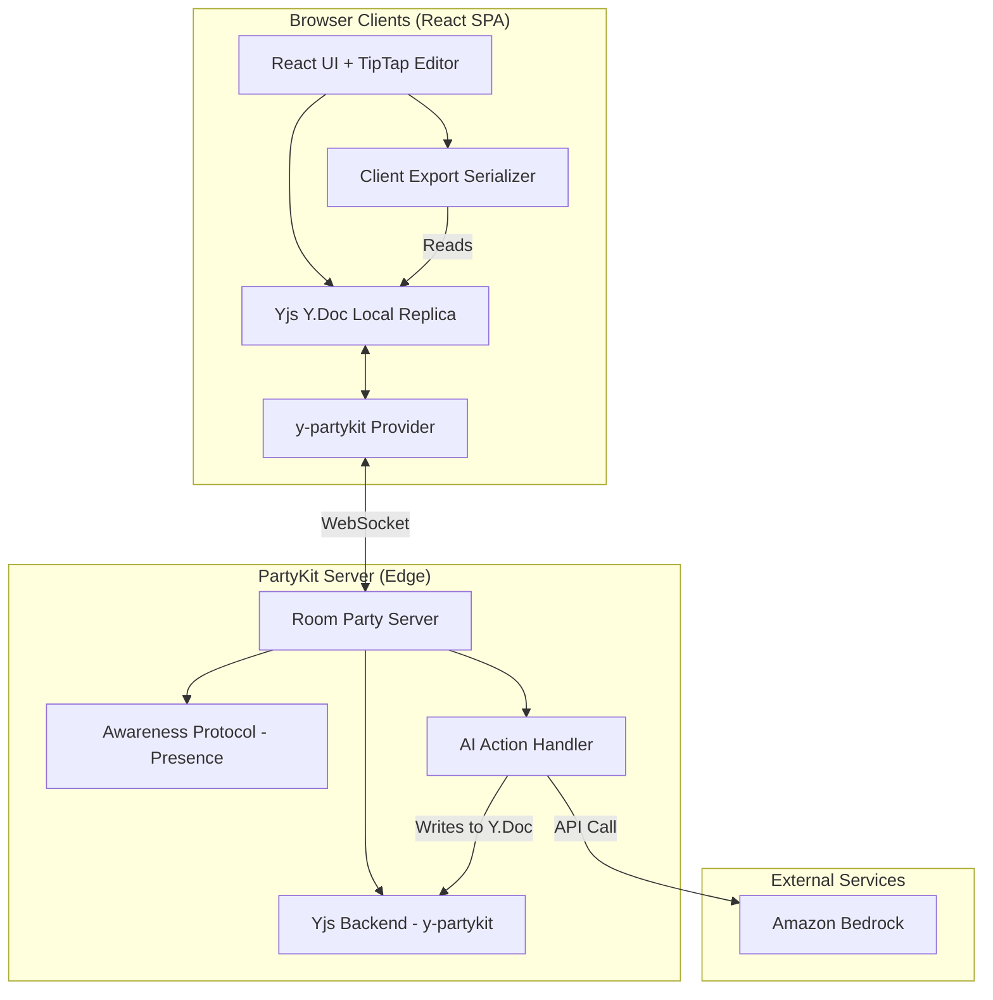
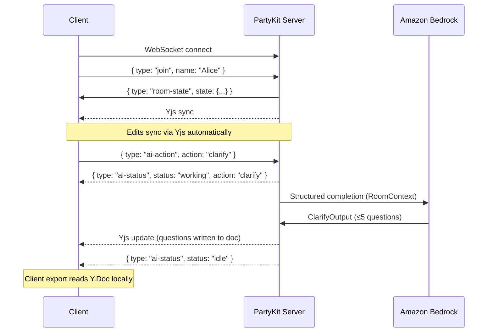

# Design Document: Sprint Room

## Overview

Sprint Room is a real-time multiplayer workspace where humans and one AI agent collaborate to turn unstructured ideas into a sprint-ready packet. The system uses a shared document model backed by CRDTs, WebSockets for sync and presence, and a server-side AI handler that writes into the same shared document as a visible teammate — not a private chat.

**Goal for MVP:** Two humans + one AI complete create → contribute → clarify → plan → edit → export in under 15 minutes.

### Key decisions

1. **Yjs CRDT** for conflict-free concurrent edits with sub-second sync.
2. **PartyKit** for room-based WebSockets, Yjs hosting, and presence on Cloudflare’s edge (no custom realtime server for MVP).
3. **React + TipTap** (`y-prosemirror`) for the collaborative editor.
4. **Amazon Bedrock (Converse + tools)** so clarify / plan / break-down return schema-valid JSON, then the server merges results into the shared Y.Doc.
5. **No accounts:** access = shareable link + display name on join.
6. **No database:** room state is PartyKit in-memory / Durable Object storage; rooms are session-scoped and ephemeral.
7. **Client-side export:** serialize the current Y.Doc Sprint_Packet (including human edits) to markdown or JSON in the browser.

## Architecture



### System flow

1. **Create:** Landing page → API creates room id (`nanoid(10)`) → redirect to `/room/{roomId}` with copyable link.
2. **Join:** Enter display name → PartyKit WebSocket with `?name=` (no JSON on the Yjs socket) → Y.Doc sync → presence includes humans + Sprint AI.
3. **Contribute:** Participants add raw inputs (quick-add list + free text in the editor). Changes sync via Yjs.
4. **Clarify / Plan / Break down:** Any participant clicks an AI action → HTTP `POST` to the PartyKit room → server builds `RoomContext` from Y.Doc (including notes) → Bedrock Converse (tool-structured) → merge into Y.Doc; `Y.Map("meta")` carries `aiStatus` / `lastError`.
5. **Edit together:** Team edits packet fields and answers clarifications in the shared UI. Re-clarify never deletes answered questions.
6. **Export:** Client reads latest Sprint_Packet from Y.Doc → downloads Markdown / JSON / PRD / GitHub Issues / Checklist.

### Architectural decision record

| Decision | Rationale |
| ---------- | ----------- |
| PartyKit over custom WS server | Room model, Yjs, presence, edge deploy — fits 1-day MVP |
| Yjs over OT | Conflict-free merge without central transform logic |
| AI writes into shared Y.Doc | Visible teammate; outputs are immediately co-editable |
| Structured Y types + TipTap fragment | Structured AI I/O and export; TipTap for freeform notes |
| Client-side export | Always matches latest edits; no server round-trip |
| Ephemeral rooms | Matches single-session success criteria; avoids DB work |
| Cap: 3 humans + 1 AI | Matches Req 1.3; keeps sync/latency simple |

## UI Composition (Single Room View)

One continuous room view covers the full happy path (Req 10.4). No multi-step wizard.

```plaintext
┌─────────────────────────────────────────────────────────────┐
│ Header: Sprint Room · room link [Copy] · presence avatars   │
│         (humans + Sprint AI with idle/working state)        │
├───────────────────────────────┬─────────────────────────────┤
│ Left / main                   │ Right sidebar               │
│                               │                             │
│ Raw inputs (attributable)     │ AI actions                  │
│  [ + Add idea / bug / note ]  │  [Clarify] [Plan]           │
│                               │  [Break down] (needs task)  │
│ Clarifications (Q + answer)   │                             │
│                               │ Export                      │
│ Sprint packet (editable)      │  [Markdown] [JSON]          │
│  goal · scope · tasks · AC    │  (disabled until packet)    │
│  risks                        │                             │
│                               │                             │
│ Freeform notes (TipTap)       │                             │
└───────────────────────────────┴─────────────────────────────┘
```

Presence: colored cursors in TipTap for humans; Sprint AI is labeled distinctly (type badge), not as another human cursor. AI “working” state appears on the AI avatar and disables duplicate AI triggers.

## Components and Interfaces

### 1. Room Party Server (`src/server/room.server.ts`)

Handles join/leave, presence seeding for the AI participant, capacity, and AI action dispatch.

```typescript
interface RoomState {
  id: string;                    // nanoid(10)
  createdAt: number;
  creatorConnectionId: string;
  humanCount: number;            // max 3
  aiActionInProgress: boolean;
  currentAiAction: 'clarify' | 'plan' | 'break-down' | null;
  status: 'active' | 'expired';
}

interface Participant {
  id: string;                    // connection id or 'ai_agent'
  name: string;
  type: 'human' | 'ai';
  joinedAt: number;
  isConnected: boolean;
}

// App control plane — NOT on the Yjs WebSocket (custom JSON corrupts CRDT sync)
// Join: WebSocket URL ?name=
// AI:   HTTP POST { type: 'ai-action', action, targetTaskId? }
// Meta: Y.Map("meta") aiStatus / lastError
type AIActionRequest =
  | { type: 'ai-action'; action: 'clarify' | 'plan' | 'break-down'; targetTaskId?: string };
```

**Capacity rules**
- On first connection, server ensures a single AI participant (`id: ai_agent`, `name: Sprint AI`) is in the room participant map (UI also shows Sprint AI in presence).
- Reject a 4th human join with close code `4003` (“Room is full”).
- AI does not consume a human slot.

**Room expiry**
- Rooms expire after 24 hours from `createdAt`, or when the PartyKit room is evicted from memory.
- Expired / unknown ids → close code `4004` / “Room not found”.

### 2. Frontend (`src/client/`)

```typescript
interface RoomPageProps {
  roomId: string;
}

interface AwarenessState {
  user: {
    id: string;
    name: string;
    color: string;     // from preset non-colliding palette
    type: 'human' | 'ai';
  };
  cursor?: { anchor: number; head: number };
  aiStatus?: 'idle' | 'clarifying' | 'planning' | 'breaking-down';
}

interface AIActionBarProps {
  onAction: (action: 'clarify' | 'plan' | 'break-down', targetTaskId?: string) => void;
  isAIWorking: boolean;
  selectedTaskId?: string;
}

interface ExportControlsProps {
  onExport: (format: 'markdown' | 'json') => void;
  hasSprintPacket: boolean;
}
```

**Pages:** `/` (create room, one CTA) · `/room/[roomId]` (join gate + room view).

### 3. AI Action Handler (`src/server/ai-handler.ts`)

```typescript
interface AIHandler {
  clarify(context: RoomContext): Promise<ClarifyOutput>;
  plan(context: RoomContext): Promise<SprintPacket>;
  breakDown(context: RoomContext, taskId: string): Promise<BreakDownOutput>;
}

interface RoomContext {
  rawInputs: RawInput[];
  clarifications: Clarification[];
  currentPacket: SprintPacket | null;
  participantNames: string[];
}

interface RawInput {
  authorName: string;
  content: string;
}

interface Clarification {
  question: string;
  answer: string | null;
}

interface ClarifyOutput {
  questions: ClarifyQuestion[]; // validated ≤ 5
}

interface ClarifyQuestion {
  id: string;
  question: string;
  context: string; // why this question matters for planning
}

interface SprintPacket {
  sprintGoal: string;
  inScope: string[];
  outOfScope: string[];
  tasks: Task[];
  risksAndDependencies: string[];
  assumptions?: string[]; // explicit when context incomplete
}

interface Task {
  id: string;
  title: string;
  description: string;
  priority: 'high' | 'medium' | 'low';
  acceptanceCriteria: string[];
  subtasks?: Task[];
  parentTaskId?: string | null;
}

interface BreakDownOutput {
  parentTaskId: string;
  parentTaskTitle: string;
  subtasks: Task[];
}
```

**Concurrency:** If `aiActionInProgress`, reject new AI actions with “AI is busy”.

**Timeout:** Abort Bedrock call at 28s; surface “AI took too long — try again”; reset status to idle (Req 7.4 / 10.2).

### 4. Context Builder (`src/server/context-builder.ts`)

```typescript
interface ContextBuilder {
  buildContext(doc: Y.Doc): RoomContext;
}
```

Reads `rawInputs`, `clarifications`, and `sprintPacket` from the Y.Doc. Must include every input and answered clarification (Req 2.5, 5.2, 6.3).

### 5. Export Service (`src/client/export.ts`)

Client-only. No WebSocket export message.

```typescript
interface ExportService {
  hasPacket(doc: Y.Doc): boolean;
  toMarkdown(packet: SprintPacket): string;
  toJSON(packet: SprintPacket): string;
  download(format: 'markdown' | 'json', packet: SprintPacket): void;
}
```

Export uses the structured `sprintPacket` map after the UI has written human edits back into it (controlled fields bind to Y types; TipTap notes are optional appendix in markdown export).

## Data Models

### Yjs document structure

```plaintext
Y.Doc (one per room)
├── Y.Map("meta")
│   ├── roomId: string
│   ├── createdAt: number
│   └── status: 'active' | 'completed'
│
├── Y.Array("rawInputs")
│   └── Y.Map
│       ├── id, authorId, authorName, content, timestamp
│
├── Y.Array("clarifications")
│   └── Y.Map
│       ├── questionId, question, questionContext
│       ├── answer, answeredBy, timestamp
│
├── Y.Map("sprintPacket")
│   ├── sprintGoal: string
│   ├── inScope: Y.Array<string>
│   ├── outOfScope: Y.Array<string>
│   ├── tasks: Y.Array<Y.Map>   // Task fields + nested subtasks
│   ├── risksAndDependencies: Y.Array<string>
│   └── assumptions: Y.Array<string>
│
└── Y.XmlFragment("notes")
    └── TipTap freeform collaborative notes
```

**Source of truth for export:** `sprintPacket` Y.Map (not TipTap notes). Notes are supplementary context for humans and optional markdown appendix.

### Room ID format

- `nanoid(10)`, charset `A-Za-z0-9_-`
- URL: `{base_url}/room/{roomId}`

### Awareness (presence)

```typescript
// Human
{ user: { id: "conn_abc", name: "Alice", type: "human", color: "#E4572E" } }

// AI (server-seeded)
{
  user: { id: "ai_agent", name: "Sprint AI", type: "ai", color: "#2A9D8F" },
  aiStatus: "idle" // | clarifying | planning | breaking-down
}
```

### Message flow



## Agent Behavior and Prompting Strategy

Implements Requirements 5, 6, 7, 8, and 11.

### Role

Sprint AI is a planning teammate inside the room. It only runs when a human triggers **clarify**, **plan**, or **break down**. It never opens a private side-channel.

### Shared system preamble (all actions)

```plaintext
You are Sprint AI, a planning teammate in a multiplayer sprint room.
Ground every output in the provided room context only.
Do not invent stakeholders, systems, deadlines, or constraints.
If information is missing, state assumptions explicitly or ask questions
instead of guessing.
Keep language concise and action-oriented for sprint kickoff use.
Preserve prior team decisions and answered clarifications unless the
latest context clearly supersedes them.
```

### Action-specific instructions

| Action | Prompt focus | Output schema | Post-write merge |
| -------- | -------------- | --------------- | ------------------ |
| **clarify** | Prefer scope boundaries, ownership, blockers, constraints. Max 5 questions. Skip questions already answered. | `ClarifyOutput` | Append questions to `clarifications` (answer null) |
| **plan** | Produce a kickoff-ready Sprint_Packet. Prefer clarify over speculative plan if context is too thin — but if user explicitly ran plan, produce best-effort packet with `assumptions[]` filled. | `SprintPacket` | Replace `sprintPacket` while preserving task ids the team already edited when titles still match; otherwise rewrite cleanly and keep answered clarifications untouched |
| **break-down** | Decompose one selected task into sprint-sized subtasks with AC each. Keep parent id. | `BreakDownOutput` | Attach subtasks under parent; set `parentTaskId` |

### Context packing order

1. Answered clarifications (highest priority)
2. Current sprint packet (decisions already made)
3. Raw inputs (newest first)
4. Participant names
5. Freeform TipTap notes (truncated last)

If the prompt is near the context limit: drop oldest raw inputs, then truncate notes; never drop answered clarifications or the current packet without noting truncation in `assumptions`.

### Validation layer (server, not LLM trust)

After each LLM response:

1. Parse against Zod (or JSON Schema) for the action.
2. Clarify: truncate to 5 questions if model exceeds.
3. Plan: require non-empty `sprintGoal`, arrays present (may be empty only for out-of-scope), each task has `title` + ≥1 acceptance criterion — else treat as malformed.
4. Break-down: require `parentTaskId` + subtasks with descriptions + AC.
5. On malformed output: do not silently invent; return error to room and optionally write a short warning note into `notes`.

### Model choice (MVP)

- Default: Amazon Nova Lite on Bedrock (`amazon.nova-lite-v1:0`), overridable via `BEDROCK_MODEL_ID`.
- Temperature: `0.3` for plan/break-down; `0.4` for clarify.
- Structured outputs via Converse `toolConfig` (forced tool choice) + Zod validation; schemas match TypeScript interfaces above.
- Auth: named AWS profile via `AWS_PROFILE` (SSO / Identity Center / shared credentials); falls back to the default credential provider chain.

## Correctness Properties

### Property 1: Room ID uniqueness and format

*For any* set of room creation requests, every generated room ID SHALL be unique, URL-safe (`[A-Za-z0-9_-]+`), and exactly 10 characters.

**Validates: Requirements 1.1**

### Property 2: Participant join adds to room state

*For any* valid room and non-empty display name, joining SHALL add the human to the participant list with correct name and `type: human`, without requiring an account.

**Validates: Requirements 1.2**

### Property 3: Raw input attribution

*For any* participant and text input they submit, stored input SHALL retain their identity and original content.

**Validates: Requirements 2.2, 2.4**

### Property 4: AI context completeness

*For any* room state with raw inputs and clarification answers, `buildContext` SHALL include every raw input and every clarification answer.

**Validates: Requirements 2.5, 5.2, 6.1, 7.2**

### Property 5: Context accumulation and preservation

*For any* room with answered clarifications or an existing Sprint_Packet, later context builds SHALL include those answers and packet content.

**Validates: Requirements 6.3, 11.6**

### Property 6: Presence state correctness

*For any* joined participant, presence SHALL expose identity and type (`human` | `ai`), and the AI presence SHALL reflect working vs idle during actions.

**Validates: Requirements 4.1, 4.3, 4.5**

### Property 7: Clarify question limit

*For any* clarify result accepted by the server, questions length SHALL be ≤ 5.

**Validates: Requirements 6.4**

### Property 8: Sprint Packet structure completeness

*For any* plan result accepted by the server, the Sprint_Packet SHALL include sprint goal, in-scope, out-of-scope, prioritized tasks with acceptance criteria, and risks/dependencies.

**Validates: Requirements 7.1**

### Property 9: Break-down structural completeness

*For any* accepted break-down result, each subtask SHALL have description and acceptance criteria, and the parent task id SHALL be preserved.

**Validates: Requirements 8.1, 8.2, 8.4**

### Property 10: Markdown export completeness

*For any* Sprint_Packet in the shared document, markdown export SHALL include all required sections with content matching the source.

**Validates: Requirements 9.1, 9.3, 9.5**

### Property 11: JSON export round-trip

*For any* Sprint_Packet in the shared document, JSON export SHALL parse back to an object with matching field values.

**Validates: Requirements 9.2, 9.3, 9.5**

### Property 12: Action validation

*For any* AI action string, the server SHALL accept only `clarify`, `plan`, and `break-down` and reject others.

**Validates: Requirements 11.1**

### Property 13: Human capacity

*For any* room, at most 3 human participants SHALL be connected concurrently; the AI participant SHALL always be present in presence once the room is active.

**Validates: Requirements 1.3, 5.1**

## Error Handling

### Client-side

| Error | Handling | UX |
| ------- | ---------- | ----- |
| Invalid / expired room | Show not-found + create-new CTA | Clear, no blank editor |
| WebSocket disconnect | Reconnect with backoff (1s/2s/4s, max 3) | “Reconnecting…” banner; Yjs resyncs |
| AI timeout (>30s) | Reset local AI working state | “AI took too long — try again” |
| Export with empty packet | Disable buttons + short explanation | Matches Req 9.4 |
| Empty / too-long name | Validate 1–30 chars | Inline join error |

### Server-side

| Error | Handling | Recovery |
| ------- | ---------- | ---------- |
| Bedrock 5xx / network | `error` message to room; clear `aiActionInProgress` | Manual retry |
| Bedrock throttle (429) | Up to 2 retries with backoff; notify delay | Then surface error |
| Unknown room | Close `4004` | Client not-found |
| 4th human join | Reject join | “Room is full (3 humans + AI)” |
| Concurrent AI action | Reject with “AI is busy” | Wait for idle |
| Yjs merge conflicts | CRDT merge | Transparent |

### AI-specific

- **Malformed structured output:** reject write; toast + optional warning in notes; do not invent fields.
- **Context too large:** truncate per packing rules; add assumption note about truncation.
- **Plan with thin context:** still allow plan when triggered; fill `assumptions` rather than fabricating facts (Req 11.2–11.4).

## Testing Strategy

### Unit (example-based)

- Room id format / URL
- Join / leave / capacity (3 humans + AI)
- Message validation
- Context builder extraction from Y.Doc
- Export markdown/JSON edge cases
- AI response validation (Zod) for all three actions

### Property-based (fast-check, ≥100 iterations)

Tag: `Feature: sprint-room, Property {N}: {title}`

| # | Property | Generator idea |
| --- | ---------- | ---------------- |
| 1 | Room ID uniqueness/format | Batch creates |
| 2 | Participant join | Random names |
| 3 | Raw input attribution | Random (user, text) |
| 4 | AI context completeness | Random inputs + clarifications |
| 5 | Context accumulation | Growing sequential states |
| 6 | Presence type/status | Random humans + AI status |
| 7 | Clarify ≤ 5 | Oversized mock outputs through validator |
| 8 | Packet structure | Random packets through validator |
| 9 | Break-down structure | Random tasks |
| 10 | Markdown sections | Random packets |
| 11 | JSON round-trip | Random packets |
| 12 | Action validation | Arbitrary strings |
| 13 | Human capacity | Join sequences |

LLM-dependent behavior is not property-tested against the model; validators and merge logic are.

### Integration

- WS connect / disconnect / reconnect
- Two-client Yjs sync + concurrent edits
- AI actions with mocked Bedrock Converse (plus a small optional live smoke set)
- Happy path: create → join → input → clarify → plan → edit → export
- Presence including AI working state

### Smoke

- Create room returns valid id
- Valid room WS handshake
- Presenter UI / editor mounts
- Export downloads non-empty file when packet exists

### Tooling

| Tool | Purpose |
| ------ | --------- |
| Vitest | Runner |
| fast-check | Property tests |
| @testing-library/react | UI |
| MSW / vi.mock | Mock Bedrock Converse |
| yjs | Doc fixtures |

## 1-Day MVP Build Sequence

Ordered for a demoable vertical slice early, then polish.

| Block | Hours (approx) | Deliverable |
| ------- | ---------------- | ------------- |
| A. Scaffold | 1.0 | Vite/React + PartyKit + TipTap + Yjs wired; deploy env + AWS/Bedrock credentials |
| B. Rooms | 1.0 | Create room API, `/room/:id`, join name gate, copy link |
| C. Collaboration | 1.5 | Raw inputs + TipTap notes syncing; cursors; presence (humans) |
| D. AI teammate | 2.0 | AI presence, clarify/plan/break-down handlers, Y.Doc writes, busy/timeout |
| E. Packet UI + export | 1.5 | Editable packet panels bound to Y types; MD/JSON download |
| F. Hardening + demo | 1.0 | Capacity, errors, empty states, 90s demo rehearsal |

Out of day-one scope (aligns with requirements non-goals): auth, persistence DB, PM tool sync, roles, analytics, multi-agent.

## Demo Script (90 seconds)

**Setup before recording:** One host browser + one guest browser (or second profile) already on the join screen. Seed 2–3 short raw inputs if needed for speed.

| Time | Action | Spoken / on-screen |
| ------ | -------- | -------------------- |
| 0:00–0:10 | Host clicks **Create room**, copies link | “One link — no accounts.” |
| 0:10–0:20 | Guest joins with name; both appear in presence with Sprint AI | “Humans and Sprint AI share one room.” |
| 0:20–0:35 | Both add a raw input (feature + constraint) | “Everyone dumps context at once.” |
| 0:35–0:50 | Host clicks **Clarify**; questions appear; guest answers one | “AI asks only what blocks a good plan.” |
| 0:50–1:10 | Host clicks **Plan**; packet fills (goal, scope, tasks, AC, risks) | “Same shared artifact — not a private chat.” |
| 1:10–1:20 | Guest edits a task title; host selects a task → **Break down** | “Team and AI edit together.” |
| 1:20–1:30 | Host exports Markdown; open file showing goal + tasks + AC | “Kickoff-ready export in one session.” |

**Demo success check:** Export contains sprint goal, prioritized tasks, and acceptance criteria without switching tools.
