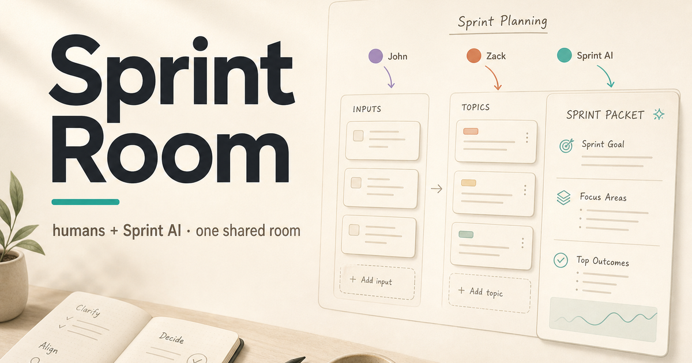
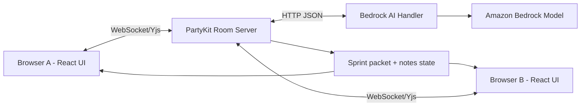

# Sprint Room

Multiplayer workspace where humans and one AI teammate turn messy ideas into a sprint-ready plan in one session.



## What you get

1. Create a room → share a link (no accounts)
2. Teammates join with a display name (max 3 humans + Sprint AI)
3. Add raw inputs together in real time
4. AI actions: **Clarify** → **Plan** → **Break down** (Amazon Bedrock)
5. Edit the shared sprint packet → export **Markdown**, **JSON**, **PRD outline**, **GitHub Issues**, or **Checklist**

## Prerequisites

- Node.js 18+
- AWS credentials via a **named profile** (`AWS_PROFILE`) — SSO / IAM Identity Center preferred
- Model access enabled in the [Bedrock console](https://console.aws.amazon.com/bedrock/) for your region

## Getting started

```bash
npm install
cp .env.example .env
# Edit .env: AWS_REGION, AWS_PROFILE=<your profile name>
aws sso login --profile <your-profile-name>   # if using SSO / Identity Center
```

You need **two processes** (two terminals):

```bash
# Terminal 1 — realtime + AI server (PartyKit, usually :1999)
# Resolves AWS_PROFILE → temporary keys, then starts PartyKit (Workers-safe)
npm run partykit:dev

# Terminal 2 — web UI (Vite, usually :5173)
npm run dev
```

Open <http://localhost:5173>

| Variable | Where | Purpose |
| ---------- | -------- | --------- |
| `AWS_REGION` | `.env` | Bedrock region (e.g. `us-east-1`) |
| `AWS_PROFILE` | `.env` | Profile from `~/.aws/config` (SSO / shared credentials) |
| `BEDROCK_MODEL_ID` | `.env` (optional) | Default `amazon.nova-lite-v1:0` |
| `VITE_PARTYKIT_HOST` | `.env` → Vite | Browser WebSocket host (default `localhost:1999`) |

PartyKit cannot read `~/.aws` itself (Cloudflare Workers runtime).
`npm run partykit:dev` runs `scripts/with-aws-profile.mjs`, which resolves your profile on Node, writes temporary `AWS_ACCESS_KEY_ID` / `AWS_SECRET_ACCESS_KEY` / `AWS_SESSION_TOKEN` to gitignored `.env.local` (so the PartyKit worker can see them), then starts PartyKit. The worker calls Bedrock with `aws4fetch` (no Node `fs`).

### Which AWS profile? (you can keep others for other work)

`AWS_PROFILE` in this repo’s `.env` applies **only** to Sprint Room’s PartyKit process. It does not change your shell’s default profile for other tools.

**Option A — set it for this app (recommended)**
In `.env`:

```bash
AWS_PROFILE=sprint-bedrock   # any name from ~/.aws/config
```

**Option B — one-shot when starting the server** (overrides `.env` for that command):

```bash
AWS_PROFILE=sprint-bedrock npm run partykit:dev
```

**Option C — temporary in the current terminal only:**

```bash
export AWS_PROFILE=sprint-bedrock
npm run partykit:dev
# your other terminals keep whatever profile they already use
```

List profiles with `aws configure list-profiles`. For SSO: `aws sso login --profile sprint-bedrock`.

Do **not** put static access keys in `.env` unless you have a strong reason. Prefer Identity Center / SSO profiles.

## Happy-path walkthrough

1. Click **Create Room**
2. Enter a display name → **Join**
3. **Copy link** → open in a second browser / profile → join as another person
4. Both add a few raw inputs (feature idea, bug, constraint)
5. Click **Clarify** → answer 1–2 questions in the clarifications panel
6. Click **Plan** → review/edit the sprint packet (goal, scope, tasks, AC, risks)
7. Select a task → **Break down** (optional)
8. **Export** Markdown, JSON, PRD outline, GitHub Issues, or Checklist (same packet, different shapes)

### 90-second demo script

| Time | Action |
| ------ | -------- |
| 0:00–0:10 | Create room, copy link |
| 0:10–0:20 | Guest joins; both see presence + Sprint AI |
| 0:20–0:35 | Add raw inputs from both sides |
| 0:35–0:50 | Clarify → guest answers one question |
| 0:50–1:10 | Plan → packet appears for everyone |
| 1:10–1:20 | Edit a task; optional Break down |
| 1:20–1:30 | Export Markdown; show goal + tasks + AC |

**Demo check:** export is usable for sprint kickoff without pasting into another tool first.

## Scripts

| Script | Purpose |
| -------- | --------- |
| `npm run dev` | Vite UI |
| `npm run partykit:dev` | PartyKit room server |
| `npm test` | Unit / property / smoke tests |
| `npm run build` | Production client build |
| `npm run partykit:deploy` | Deploy PartyKit server |
| `npm run e2e:live -- <roomUrl> [holdSeconds]` | Playwright bot joins a live room |
| `npm run e2e:lead -- <roomUrl> [holdSeconds]` | Playwright bot drives clarify → answer → plan |

## Quick smoke commands

Use these after both servers are running:

```bash
# Open in browser
http://localhost:5173

# Optional automated participants
npm run e2e:live -- http://localhost:5173/room/<roomId> 90
npm run e2e:lead -- http://localhost:5173/room/<roomId> 90
```

## Troubleshooting

| Symptom | Likely fix |
| --------- | ------------ |
| Join says “Not connected to the room server” | Start `npm run partykit:dev`; confirm `VITE_PARTYKIT_HOST=localhost:1999` |
| AI actions error / AccessDenied | `aws sso login --profile …`; enable Bedrock model access; IAM needs Converse/`InvokeModel` |
| `Unsupported node builtin: fs` / `child_process` | Always use `npm run partykit:dev` (not bare `partykit dev`) so the profile wrapper runs |
| Failed to resolve AWS credentials | Wrong `AWS_PROFILE`, or SSO session expired — re-run `aws sso login --profile …` |
| Toast: Missing AWS credentials in the PartyKit worker | Restart with `npm run partykit:dev` (must write `.env.local`); bare `partykit dev` will not |
| AI timeout / throttle | Check region + quota; wait and retry |
| “Room is full” | Max 3 humans per room; open a new room |
| Reconnecting banner | PartyKit restarted or network blip — wait for resync |

## Project layout

```plaintext
src/client/   React UI (TipTap notes, panels, export)
src/server/   PartyKit room server + Bedrock AI handler
src/shared/   Types and constants
.kiro/specs/sprint-room/   Requirements, design, tasks
.kiro/steering/            Product / tech / AI teammate guidance
```

## Simple architecture



Rooms are ephemeral (in-memory PartyKit state, ~24h). No accounts or database in the MVP.
